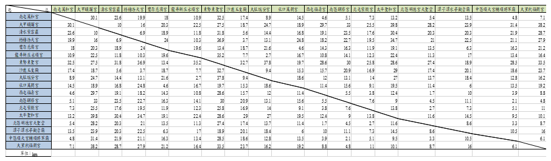

# NCTU-Introductory-Transportation-Network

## 題目說明
<li>2020 年總統大選某候選人在台中地區參拜以下 18 個宮廟: 
南屯萬和宮, 大甲鎮瀾宮, 清水紫雲巖, 梧棲浩天宮, 豐原慈濟宮, 龍井新庄永順宮, 東勢東聖宮, 沙鹿玉皇殿, 大肚瑞安宮, 社口萬興宮, 西屯福壽宮, 南區醒修宮, 北屯紫微宮,  太平聖和宮, 北區明德宮天聖堂, 潭子潭水亭觀音廟, 中區順天宮輔順將軍廟, 大里杙福興宮。</li>

## 條件假設
<li>這 18 個宮廟間的距離矩陣如下圖，假設任兩點互連(connected)，而且兩點間的距離為對稱(symmetric)。此位候選人打算從南屯萬和宮出發，拜訪每間宮廟剛好一次，最後回到南屯萬和宮。每間宮廟的停留時間不同，所以不列入考慮。 </li>

## 分析問題
<li>為Traveling Salesman Problem(旅行業務員問題)，屬於NP-Hard問題</li>
<li>蠻力法需計算 (n-1)!條路徑成本</li>
<li>故採用動態規劃(Dynamic Programming)求解</li>
